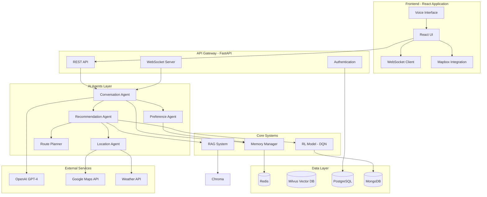

# tourism-ai-# 🗺️ Tourism AI Agent System

## Intelligent Travel Assistant with Reinforcement Learning & Real-time Recommendations


---

## 📋 Table of Contents

1. [Overview](#-overview)
2. [System Architecture](#-system-architecture)
3. [Core Features](#-core-features)
4. [Technology Stack](#-technology-stack)
5. [Installation Guide](#-installation-guide)
6. [System Components](#-system-components)
7. [How It Works](#-how-it-works)
8. [API Documentation](#-api-documentation)
9. [Configuration](#-configuration)
10. [Development Guide](#-development-guide)
11. [Deployment](#-deployment)
12. [Performance & Optimization](#-performance--optimization)
13. [Contributing](#-contributing)
14. [License](#-license)

---

## 🌟 Overview

An intelligent travel assistant powered by GPT-4, Reinforcement Learning, and real-time location services. Provides personalized recommendations through natural conversation.

### 🎯 Key Highlights

- **Conversational AI**: Natural language interface powered by GPT-4
- **Personalized Recommendations**: ML-based preference learning and RL optimization
- **Real-time Data**: Live weather, traffic, and place information
- **Smart Route Planning**: Multi-objective optimization for efficient itineraries
- **Adaptive Learning**: Continuously improves through user feedback
- **Multi-modal Search**: Combines vector and keyword search for accurate results

### 🚀 What Makes This System Unique?

1. **Hybrid Intelligence**: Combines rule-based logic, machine learning, and reinforcement learning
2. **Context Awareness**: Considers weather, time, location, and user state
3. **Multi-source Data**: Integrates local knowledge base with real-time Google Places
4. **Explainable AI**: Provides clear reasoning for recommendations
5. **Progressive Learning**: Improves over time through experience replay

---

## 🏗️ System Architecture



### 🔄 Data Flow

1. **User Input** → Chat Interface → WebSocket/REST API
2. **Intent Classification** → Conversation Agent → Preference Extraction
3. **Knowledge Retrieval** → RAG System → Vector + BM25 Search
4. **Location Services** → Real-time Data → Google Places + Weather
5. **Recommendation Generation** → RL Ranking → Multi-objective Scoring
6. **Response Synthesis** → Natural Language → User Interface
7. **Feedback Loop** → Experience Storage → Model Updates

---

## ✨ Core Features

### 1. 🤖 **Intelligent Conversation System**
- Natural language understanding with GPT-4
- Multi-turn dialogue management
- Context retention across sessions
- Intent classification and entity extraction
- Support for voice input/output
- Real-time typing indicators

### 2. 🎯 **Personalized Recommendations**
- **Preference Learning**: Extracts explicit and implicit preferences
- **Contextual Adaptation**: Adjusts for weather, time, crowds
- **Reinforcement Learning**: DQN-based optimization
- **Multi-objective Scoring**: Balances distance, relevance, popularity
- **Diversity Control**: Ensures varied recommendations
- **Explanation Generation**: Clear reasoning for each suggestion

### 3. 📍 **Location-Aware Services**
- Real-time GPS tracking
- Nearby place discovery
- Distance calculations
- Traffic-aware routing
- Weather integration
- Opening hours verification

### 4. 🗺️ **Smart Route Planning**
- **TSP Optimization**: For small sets of destinations
- **Genetic Algorithm**: For complex multi-stop routes
- **Time Windows**: Considers opening/closing times
- **Multi-modal Transport**: Walking, driving, transit options
- **Budget Constraints**: Cost-aware planning
- **Accessibility Options**: Wheelchair-friendly routes

### 5. 📊 **Learning & Adaptation**
- Experience replay buffer
- Preference confidence updates
- Episodic memory storage
- A/B testing framework
- Performance analytics
- Model retraining pipeline

### 6. 🔍 **Hybrid Search System**
- **Vector Search**: Semantic similarity using embeddings
- **BM25 Search**: Keyword-based retrieval
- **Hybrid Ranking**: Combines both approaches
- **Dynamic Filtering**: Location, price, category filters
- **Result Reranking**: ML-based relevance scoring

---

## 🛠️ Technology Stack

### Backend
| Component | Technology | Purpose |
|-----------|------------|---------|
| **API Framework** | FastAPI | High-performance async API |
| **Language Model** | OpenAI GPT-4 | Natural language processing |
| **ML Framework** | PyTorch | Deep learning models |
| **RL Library** | Gymnasium | Reinforcement learning env |
| **Embeddings** | Sentence-BERT | Text vectorization |
| **Task Queue** | Celery | Async task processing |
| **WebSocket** | python-socketio | Real-time communication |

### Data Storage
| Component | Technology | Purpose |
|-----------|------------|---------|
| **Vector DB** | Milvus | Similarity search |
| **Cache** | Redis | Session & memory storage |
| **Primary DB** | PostgreSQL | User data & preferences |
| **Document DB** | MongoDB | Episodes & logs |
| **Search Engine** | Elasticsearch* | Full-text search (optional) |

### Frontend
| Component | Technology | Purpose |
|-----------|------------|---------|
| **Framework** | React 18 | UI components |
| **Language** | TypeScript | Type safety |
| **State Management** | Zustand | Global state |
| **Maps** | Mapbox GL | Interactive maps |
| **Styling** | Tailwind CSS | Utility-first CSS |
| **Animations** | Framer Motion | Smooth transitions |
| **Data Fetching** | TanStack Query | Server state management |

### External Services
| Service | Provider | Purpose |
|---------|----------|---------|
| **Maps & Places** | Google Maps | Location data |
| **Weather** | OpenWeatherMap | Weather conditions |
| **Geocoding** | Nominatim | Address resolution |
| **Speech** | Web Speech API | Voice input/output |

---

## 📦 Installation Guide

### Prerequisites

- **Python 3.9+**
- **Node.js 18+**
- **Docker & Docker Compose**
- **Git**

### API Keys Required

1. **OpenAI API Key** - [Get it here](https://platform.openai.com/api-keys)
2. **Google Maps API Key** - [Get it here](https://console.cloud.google.com/google/maps-apis)
3. **OpenWeatherMap API Key** - [Get it here](https://openweathermap.org/api)
4. **Mapbox Token** - [Get it here](https://www.mapbox.com/account/access-tokens)

### Step 1: Clone the Repository

```bash
git clone https://github.com/yourusername/tourism-ai-agent.git
cd tourism-ai-agent
```

### Step 2: Backend Setup

```bash
# Navigate to backend directory
cd backend

# Create virtual environment
python -m venv venv
source venv/bin/activate  # On Windows: venv\Scripts\activate

# Install dependencies
pip install -r requirements.txt

# Create .env file
cp .env.example .env
# Edit .env and add your API keys
```

### Step 3: Start Docker Services

```bash
# Start all required services
docker-compose up -d

# Verify services are running
docker-compose ps
```

### Step 4: Initialize Databases

```bash
# Run database migrations
python scripts/init_db.py

# Load sample tourism data
python scripts/load_tourism_data.py --save-file
```

### Step 5: Start Backend Server

```bash
# Run the FastAPI application
uvicorn src.main:app --reload --host 0.0.0.0 --port 8000

# API will be available at http://localhost:8000
# API docs at http://localhost:8000/docs
```

### Step 6: Frontend Setup

```bash
# Open new terminal and navigate to frontend
cd ../frontend

# Install dependencies
npm install

# Create .env file
cp .env.example .env
# Add your Mapbox token and API URL

# Start development server
npm run dev

# Frontend will be available at http://localhost:5173
```

---

## 🧩 System Components

### 1. Memory System (`src/core/memory.py`)

The memory system manages different types of memory for context retention and learning:

- **Conversation Memory**: Stores chat history with Redis
- **User Profile Memory**: Long-term preference storage
- **Episodic Memory**: Successful interaction patterns
- **Working Memory**: Temporary processing state

```python
memory_manager = MemoryManager(redis_host="localhost")
memory_manager.conversation.add_message(session_id, message)
context = memory_manager.get_full_context(session_id, user_id)
```

### 2. RAG System (`src/core/rag_system.py`)

Implements Retrieval-Augmented Generation for knowledge-based responses:

- **Hybrid Search**: Combines vector and keyword search
- **Document Chunking**: Splits content for optimal retrieval
- **Embedding Generation**: Creates semantic vectors
- **Result Reranking**: ML-based relevance scoring

```python
rag_system = RAGSystem(
    embedding_model="sentence-transformers/all-mpnet-base-v2",
    milvus_host="localhost"
)
results = rag_system.hybrid_search(query, top_k=10)
```

### 3. Conversation Agent (`src/agents/conversation_agent.py`)

Manages natural dialogue flow:

- **Intent Classification**: Understands user intentions
- **State Management**: Tracks conversation progress
- **Response Generation**: Creates contextual responses
- **Entity Extraction**: Identifies key information

### 4. Preference Agent (`src/agents/preference_agent.py`)

Learns and manages user preferences:

- **Explicit Extraction**: From direct statements
- **Implicit Learning**: From behavior patterns
- **Confidence Scoring**: Weights preference reliability
- **Contextual Adaptation**: Adjusts for current context

### 5. Recommendation Agent (`src/agents/recommendation_agent.py`)

Generates personalized recommendations using RL:

- **Deep Q-Network**: Neural network for action-value estimation
- **Experience Replay**: Stores and learns from past interactions
- **Multi-objective Optimization**: Balances multiple criteria
- **Exploration vs Exploitation**: ε-greedy strategy

```python
# DQN Architecture
class DeepQNetwork(nn.Module):
    def __init__(self, state_size: int, action_size: int):
        self.fc1 = nn.Linear(state_size, 128)
        self.fc2 = nn.Linear(128, 64)
        self.fc3 = nn.Linear(64, 32)
        self.fc4 = nn.Linear(32, action_size)
```

### 6. Location Agent (`src/agents/location_agent.py`)

Handles all location-based services:

- **Place Discovery**: Finds nearby attractions
- **Route Calculation**: Multi-modal routing
- **Weather Integration**: Current conditions
- **Real-time Updates**: Traffic, crowds, events

### 7. Route Planner (`src/agents/route_planner.py`)

Optimizes multi-stop itineraries:

- **TSP Solver**: For optimal route ordering
- **Genetic Algorithm**: For complex constraints
- **Time Windows**: Respects opening hours
- **Budget Optimization**: Cost-aware planning

---

## 🔄 How It Works

### User Journey Flow

1. **User Interaction**
   ```
   User: "I want to explore museums and have lunch nearby"
   ```

2. **Intent & Entity Extraction**
   ```json
   {
     "intent": "ask_recommendation",
     "entities": {
       "activities": ["museums"],
       "needs": ["lunch"],
       "proximity": "nearby"
     }
   }
   ```

3. **Preference Update**
   - Stores interest in museums (confidence: 0.9)
   - Notes meal timing preference
   - Updates user profile

4. **Knowledge Retrieval**
   - Searches vector DB for museums
   - Queries Google Places for real-time data
   - Filters by distance and opening hours

5. **Recommendation Scoring**
   ```python
   score = (relevance * 0.35 + 
            distance * 0.25 + 
            popularity * 0.20 + 
            novelty * 0.10 + 
            diversity * 0.10)
   ```

6. **RL-based Reranking**
   - DQN predicts Q-values for each option
   - Applies ε-greedy exploration
   - Selects top recommendations

7. **Route Optimization**
   - Plans efficient museum tour
   - Adds lunch stop at optimal time
   - Considers walking distances

8. **Response Generation**
   ```
   "I found 3 excellent museums near you! The Natural History 
   Museum is just 10 minutes away and highly rated. For lunch, 
   there's a great Italian restaurant next door. Would you like 
   me to create a walking route?"
   ```

9. **Learning from Feedback**
   - User visits recommendations
   - Provides ratings
   - System updates Q-values
   - Adjusts preference confidence

### Reinforcement Learning Process

```python
# State representation (100 dimensions)
state = [
    user_preferences,      # 50 dims
    context_features,      # 20 dims  
    location_features,     # 30 dims
]

# Action space (recommendations)
actions = candidate_recommendations  # up to 50

# Reward calculation
reward = user_rating - 3.0  # Normalized [-2, 2]

# Q-learning update
Q(s,a) = Q(s,a) + α[r + γ max Q(s',a') - Q(s,a)]
```

---

## 📚 API Documentation

### Core Endpoints

#### 1. Chat Endpoint
```http
POST /chat
Content-Type: application/json

{
  "message": "Find Italian restaurants",
  "session_id": "session_123",
  "user_id": "user_456",
  "location": {
    "lat": 59.8586,
    "lng": 17.6389
  }
}

Response:
{
  "message": "I found 5 Italian restaurants...",
  "recommendations": [...],
  "session_id": "session_123"
}
```

#### 2. Get Recommendations
```http
POST /recommendations
Content-Type: application/json

{
  "user_id": "user_456",
  "location": {"lat": 59.8586, "lng": 17.6389},
  "preferences": {"cuisine": "Italian"},
  "num_recommendations": 5
}

Response:
{
  "recommendations": [
    {
      "id": "rec_001",
      "name": "Luigi's Pizzeria",
      "type": "restaurant",
      "distance": 0.5,
      "rating": 4.7,
      "explanation": "Matches your preference for Italian food"
    }
  ]
}
```

#### 3. Plan Route
```http
POST /route/plan
Content-Type: application/json

{
  "user_id": "user_456",
  "place_ids": ["place_1", "place_2", "place_3"],
  "constraints": {
    "start_time": "2024-01-20T10:00:00",
    "max_duration_hours": 5,
    "transport_mode": "walking"
  }
}

Response:
{
  "route": {
    "waypoints": [...],
    "total_distance_km": 3.2,
    "total_duration_hours": 4.5,
    "segments": [...]
  }
}
```

#### 4. WebSocket Connection
```javascript
const ws = new WebSocket('ws://localhost:8000/ws/session_123');

ws.send(JSON.stringify({
  message: "Hello",
  user_id: "user_456",
  location: {...}
}));

ws.onmessage = (event) => {
  const response = JSON.parse(event.data);
  console.log(response.message);
};
```

### Complete API Reference

See full API documentation at `http://localhost:8000/docs` when running the server.

---

## ⚙️ Configuration

### Environment Variables

```env
# OpenAI Configuration
OPENAI_API_KEY=sk-...
OPENAI_MODEL=gpt-4-turbo-preview

# Google APIs
GOOGLE_MAPS_API_KEY=AIza...
GOOGLE_PLACES_API_KEY=AIza...

# Weather API
OPENWEATHER_API_KEY=...

# Database Configuration
POSTGRES_HOST=localhost
POSTGRES_PORT=5432
POSTGRES_DB=tourism_agent
POSTGRES_USER=postgres
POSTGRES_PASSWORD=password

# Redis
REDIS_HOST=localhost
REDIS_PORT=6379

# Milvus Vector DB
MILVUS_HOST=localhost
MILVUS_PORT=19530

# MongoDB
MONGODB_URI=mongodb://localhost:27017/tourism_agent

# Application Settings
APP_ENV=development
APP_PORT=8000
LOG_LEVEL=INFO

# Frontend
VITE_API_URL=http://localhost:8000
VITE_WS_URL=ws://localhost:8000
VITE_MAPBOX_TOKEN=pk...
```

### Confi
